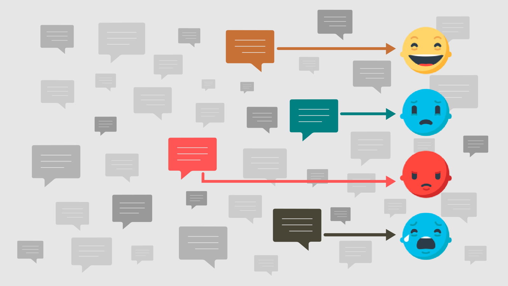

# Emotions Text Classification: Multi Class Classifications 
Multi-class sentiment analysis problem to classify texts into five emotion categories: joy, sadness, anger, fear, surprise, love. A fun mini project to go through different text classification techniques.

## Dataset
(https://www.kaggle.com/praveengovi/emotions-dataset-for-nlp)

The sentiment labels are:
- sadness
- anger
- love
- surprise
- fear
- joy

## Project Highlight
- Load the data from kaggle  
- Data Cleaning
  - Removed unwanted text, hyperlink, punctuations,Stop word removal, lemmatization 
- Data Exploratory analysis 
- Build and train the Model
- Evaluate our model on the test set

## Embedding 
- Glove pre-trained

## Model
- **CNN Classifier**

## How to Run The Code
All the code and comments are listed the jupyter notbook (Classify_emotions_in_text.ipynb)

